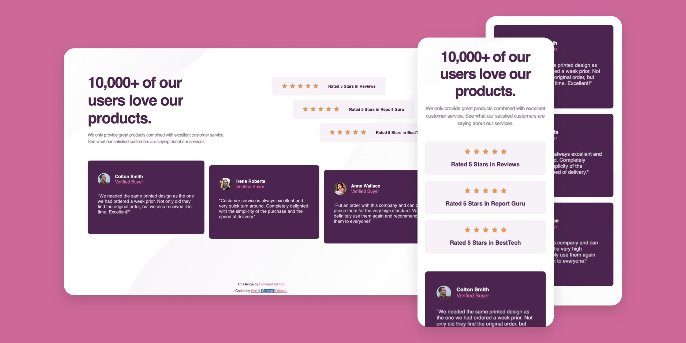

# Frontend Mentor - Social proof section solution

This is a solution to the [Social proof section challenge on Frontend Mentor](https://www.frontendmentor.io/challenges/social-proof-section-6e0qTv_bA). Frontend Mentor challenges help you improve your coding skills by building realistic projects. 


## Table of contents

- [Overview](#overview)
  - [The challenge](#the-challenge)
  - [Screenshot](#screenshot)
  - [Links](#links)
- [My process](#my-process)
  - [Built with](#built-with)
  - [What I learned](#what-i-learned)
  - [Continued development](#continued-development)
  - [Useful resources](#useful-resources)
- [Author](#author)
<!-- - [Acknowledgments](#acknowledgments) -->

## Overview

### The challenge

Users should be able to:

- View the optimal layout for the section depending on their device's screen size

### Screenshot



### Links

- Solution URL: [Solution](https://www.frontendmentor.io/solutions/responsive-social-proof-section-mrMgjHgMQ)
- Live Site URL: [Live](https://grifano.github.io/FrontendMentor__Social-proof-section/)

## My process

### Built with

- Semantic HTML5 markup
- CSS custom properties
- Flexbox
- Responsive Website
- Media Queries
- SASS/SCSS

### What I learned

I’m not Sure about "aside" for attribution 🤔... What can you think? Isn’t right way?
```html

  <aside class="attribution">
    <p class="attribution__text">Challenge by <a href="https://www.frontendmentor.io?ref=challenge"
        target="_blank">Frontend Mentor</a></p>
    <p class="attribution__text">
      Coded by <a href="#">Serhii <span class="grifano-logo"><span>{</span>Grifano<span>}</span></span> Orlenko</a>
    </p>
  </aside>

```
I read an amazing article about using CSS selectors, and applied this knowledge to practice 😀
```css
&__item {
  max-width: 509px;
  &:nth-child(1) {
    align-self: flex-start;
  }
  &:nth-child(2) {
    margin: 15px 0;
    align-self: center;
  }
  &:nth-child(3) {
    align-self: flex-end;
  }
  @media (max-width: 769px) {
    max-width: none;
  }
}
```

### Continued development

I want to continue to learn a JavaScript. Currently, I'm working on Course from Udemy. App Brewery Web Developer Bootcamp. And to do practice, practice and practice one more 😉

### Useful resources

[How to Use CSS Selectors to Style Your Web Page](https://www.freecodecamp.org/news/use-css-selectors-to-style-webpage/)
[MDN:Pseudo-classes](https://developer.mozilla.org/en-US/docs/Web/CSS/:first-child)


## Author

- Website - [Serhii "{Grifano}" Orlenko"](https://grifano.webflow.io/)
- Frontend Mentor - [@Grifano](https://www.frontendmentor.io/profile/Grifano)
- Twitter - [@Grifano](https://twitter.com/OrlenkoSerhii)
- LinkedIn - [@Grifano](https://www.linkedin.com/in/serhii-orlenko-44aaa4a3/)

<!-- ## Acknowledgments ❗️ -->
